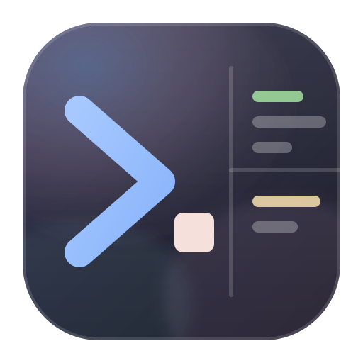
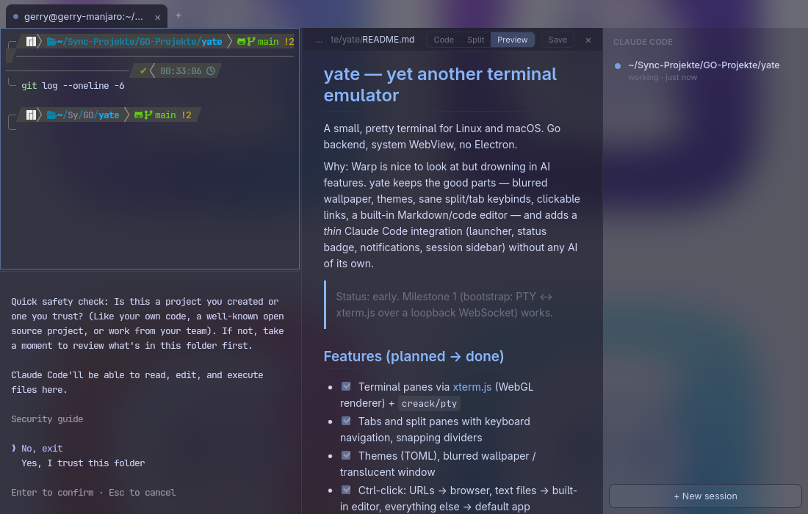

# yate — yet another terminal emulator

A small, pretty terminal for Linux and macOS. Go backend, system WebView, no Electron.

Why: Warp is nice to look at but drowning in AI features. yate keeps the good parts —
blurred wallpaper, themes, sane split/tab keybinds, clickable links, a built-in
Markdown/code editor — and adds a *thin* Claude Code integration (launcher, status badge,
notifications, session sidebar) without any AI of its own.



> Status: usable daily driver on Linux (all planned features below work); macOS build untested so far.

## Features (planned → done)

- [x] Terminal panes via [xterm.js](https://xtermjs.org) (WebGL renderer) + `creack/pty`
- [x] Tabs and split panes with keyboard navigation, snapping dividers
- [x] Themes (TOML), blurred wallpaper / translucent window
- [x] Ctrl-click: URLs → browser, text files → built-in editor, everything else → default app
- [x] Editor pane (CodeMirror 6) with Code / Split / Preview modes for Markdown
- [x] `yate open <file>[:line]` from any yate shell opens the editor next to it
- [x] Session restore: tabs, splits, directories and open files come back on the next start
- [x] Settings pane (`Ctrl+,`) with theme preview cards and a keybinding recorder
- [x] Claude Code: launcher, tab badge, "waiting for input" notifications, session sidebar

## Keybindings (defaults)

| Action | Key |
|---|---|
| Split → new pane to the right | `Ctrl+Space` |
| Split → new pane below | `Ctrl+Shift+Space` |
| Focus pane left / right / up / down | `Shift+←` / `Shift+→` / `Shift+↑` / `Shift+↓` |
| Resize: move the nearest divider left / right / up / down | `Alt+Shift+←` / `→` / `↑` / `↓` |
| Close pane (last pane closes the tab) | `Ctrl+W` |
| New tab / next / previous / tab *n* | `Ctrl+Shift+T` / `Ctrl+Tab` / `Ctrl+Shift+Tab` / `Alt+n` |
| Copy / paste | `Ctrl+Shift+C` / `Ctrl+Shift+V` (macOS also `Cmd+C` / `Cmd+V`) |
| Launch Claude Code in the current directory | `Ctrl+Shift+K` |
| Toggle agent sidebar | `Ctrl+Shift+A` |
| Settings pane | `Ctrl+,` |
| Editor: cycle Code / Split / Preview | `Ctrl+Shift+P` |
| Editor: save | `Ctrl+S` |
| Search in terminal | `Ctrl+Shift+F` |
| Font bigger / smaller / reset | `Ctrl++` / `Ctrl+-` / `Ctrl+0` |

Everything is configurable in `~/.config/yate/config.toml` (created with the defaults on
first start). `[keys.darwin]` overrides bindings on macOS only. Terminal and editor appearance
are separate sections (`[terminal]`, `[editor]`): font, size, ligatures, line height, …
Default font is JetBrains Mono at 13px with ligatures. Powerline/Nerd-Font prompts (p10k,
starship) need a patched font: the default stack tries `JetBrainsMono Nerd Font` first —
Arch: `ttf-jetbrains-mono-nerd`, macOS: `brew install font-jetbrains-mono-nerd-font`.

## Building

Requirements: Go 1.24+, Node 20+, and the platform toolchain:

- **Linux:** GTK 4 and WebKitGTK 6.0 dev packages — Arch: `gtk4 webkitgtk-6.0`,
  Debian/Ubuntu: `libgtk-4-dev libwebkitgtk-6.0-dev`.
- **macOS:** Xcode command line tools.

```sh
go install github.com/wailsapp/wails/v3/cmd/wails3@v3.0.0-beta.18
make build      # → bin/yate
make dev        # hot-reloading dev build
make test       # go test + vitest
```

## Claude Code

No AI inside yate — just a good seat for Claude Code:

- `Ctrl+Shift+K` starts `claude` in a new pane in the current directory (`[claude] command`).
- Any pane running Claude gets a status dot in its tab: blue = working, yellow = waiting for
  you, green = finished. The pane frame lights up while Claude waits.
- `Ctrl+Shift+A` opens the session sidebar (directory, state, last message); click a row to jump.
- A desktop notification fires when Claude needs you and you are looking elsewhere.

Process detection works out of the box. For precise states run **`yate install-hooks`** once:
it registers `yate hook <event>` for `SessionStart`, `UserPromptSubmit`, `Notification`, `Stop`
and `SessionEnd` in `~/.claude/settings.json` (existing hooks are kept, a backup is written).
Outside yate the hooks are silent no-ops.

### Desktop integration (Linux)

`make install` puts `yate` in `~/.local/bin` with a desktop entry that declares
`MimeType=inode/directory`, so folders offer *Open With → yate*. `make install-nautilus` adds a
first-level **Open in yate** entry to Nautilus' context menu (folder and background; needs the
`nautilus-python` package). `yate <dir>` opens the directory as a new tab in the running yate
(or starts one) — handy for launcher keybindings like Super+T.

## Shell integration

yate loads a small zsh snippet automatically (via `ZDOTDIR`, no rc-file edits) that emits the
working directory (OSC 7) and prompt marks (OSC 133). That is what makes new panes open in the
current directory and — like kitty — lets yate resize without the duplicated-prompt artifact
xterm.js-based terminals otherwise show with powerlevel10k. Disable with
`shell_integration = false`. bash and fish: `source ~/.config/yate/shell/yate.bash` /
`source ~/.config/yate/shell/yate.fish` in your rc file.

## CLI

Every shell started by yate has `$YATE_SOCKET`, `$YATE_PANE_ID` and `$YATE_TAB_ID` set, so the
`yate` binary can talk to the running instance:

```sh
yate open README.md:12      # open in an editor pane next to this terminal
yate ctl action split_down  # run any keybinding action by name
yate ctl input 'ls\n'       # type into the current pane
```

## Configuration

`Ctrl+,` opens the settings pane — vertical tabs for Themes, Background, Terminal, Editor,
Shell & Startup, Claude Code and Keybindings (click a binding, press the new keys). Every option
from `config.toml` is there. Saving edits the file in place: comments, order and your own keys
survive, and changes apply live. Editing the file by hand works just as well.

### Themes

Five themes are built in (Catppuccin Mocha, Dracula, Nord, Gruvbox Dark, Tokyo Night). yate
also **imports Ghostty and Alacritty colour schemes**, which means every scheme in
[iTerm2-Color-Schemes](https://github.com/mbadolato/iTerm2-Color-Schemes) (400+) works:
grab a file from its `ghostty/` or `alacritty/` folder, then *Settings → Themes → Import theme…*
or `yate theme import <file>`. Imported themes land in `~/.config/yate/themes/<id>.toml` where
you can tweak them; the "Browse compatible themes" button in the settings links to the catalog. See [`internal/config/defaults.toml`](internal/config/defaults.toml) for every
key with its default. `yate --config <file>` uses a different file.

### Translucent window on GNOME

`mode = "translucent"` relies on the compositor for blur. On GNOME install
[Blur my Shell](https://extensions.gnome.org/extension/3193/blur-my-shell/) and add
`io.github.gerry3010.yate` (or the `yate` window class) to its *Applications* whitelist.
`mode = "wallpaper"` blurs an image of your choice inside the window and works everywhere.

## License

MIT — see [LICENSE](LICENSE).
